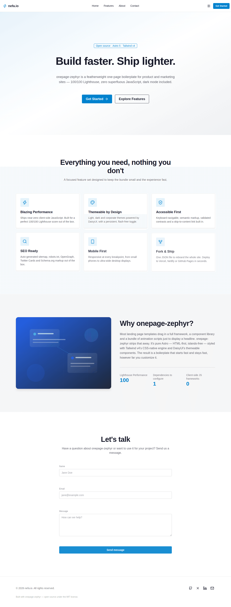

# onepage-zephyr

Lightning-fast one-page boilerplate built with **Astro 5**, **Tailwind CSS v4** & **DaisyUI 5**.
Zero bloat, 100/100 Lighthouse scores, dark mode, fully accessible. Fork, customize, deploy.

Built by [nefa.io](https://nefa.io).

[](https://github.com/sntre/onepage-zephyr/actions/workflows/ci.yml)
[](./lighthouserc.json)
[](./LICENSE)
[](https://astro.build)
[](https://tailwindcss.com)
[](https://daisyui.com)

[](https://console.nefa.io/auth/register?repository-url=https://github.com/sntre/onepage-zephyr)
[](https://vercel.com/new/clone?repository-url=https://github.com/sntre/onepage-zephyr)
[](https://app.netlify.com/start/deploy?repository=https://github.com/sntre/onepage-zephyr)

---

## Screenshot



## Stack

| [Astro](https://astro.build) | [Tailwind CSS v4](https://tailwindcss.com) | [DaisyUI 5](https://daisyui.com) | [TypeScript](https://www.typescriptlang.org) |  [Lucide](https://lucide.dev)   |
| :--------------------------: | :----------------------------------------: | :------------------------------: | :------------------------------------------: | :-----------------------------: |
| Static, HTML-first framework | CSS-native config, no `tailwind.config.js` |   Themeable component classes    |            Strict mode everywhere            | Lightweight SVG icon components |

## Why onepage-zephyr?

- ⚡️ **Near-zero JavaScript** — Astro ships HTML by default; the only client
  JS is a tiny theme toggle and a native `IntersectionObserver` scroll-reveal
- 🎨 **Themeable** — `light`, `dark` and `corporate` DaisyUI themes with a
  flash-free, `localStorage`-persisted toggle
- 🔍 **SEO complete** — sitemap, `robots.txt`, OpenGraph, Twitter Cards and
  Schema.org `Organization` markup, all generated from one config file
- ♿️ **Accessible** — semantic landmarks, keyboard navigation, skip-to-content
  link, validated color contrast, `aria-label`s throughout
- 📱 **Responsive** — mobile-first with Tailwind's standard breakpoints
- 🧭 **View Transitions** — Astro's native `ClientRouter` for smooth
  in-page/anchor navigation
- 🍴 **Fork-friendly** — rebrand the entire site from a single
  `src/content/site.json` file

## Project structure

```text
src/
  components/
    Navbar.astro       Sticky nav, smooth-scroll anchors, CSS-only mobile menu
    Hero.astro          Gradient hero, headline/subheadline, 2 CTAs
    Features.astro      3-column feature grid with Lucide icons
    About.astro          Text + <Image /> layout, optimized asset
    Contact.astro        Formspree/Netlify Forms form, HTML5 + DaisyUI validation
    Footer.astro          Social links, dynamic copyright year
    ThemeToggle.astro     Persistent dark-mode swap toggle
    SEO.astro              Meta tags, OpenGraph, Twitter Card, Schema.org
  layouts/
    Layout.astro          Shell: SEO, Navbar, Footer, FOUC-free theme boot
  pages/
    index.astro            Assembles the sections
    robots.txt.ts           Generated from the configured site URL
  styles/
    global.css              Tailwind v4 + DaisyUI CSS-native config
  content/
    site.json                 Single source of truth: copy, brand, links
```

## Getting started

```bash
git clone https://github.com/sntre/onepage-zephyr.git
cd onepage-zephyr
npm install
npm run dev
```

Open [http://localhost:4321](http://localhost:4321).

### Scripts

| Script            | Description                          |
| ----------------- | ------------------------------------ |
| `npm run dev`     | Start the local dev server           |
| `npm run build`   | Type-check and build for production  |
| `npm run preview` | Preview the production build locally |
| `npm run lint`    | Lint with ESLint (flat config)       |
| `npm run format`  | Format with Prettier                 |
| `npm run check`   | Run Astro's type checker             |

## Configuration

Almost everything is controlled from **`src/content/site.json`**: site name,
title, description, brand colors, nav links, hero copy, feature cards, about
content, contact form provider, and social links. Fork the repo, edit this
one file, and you have a rebranded site.

The canonical site URL is read from the `SITE_URL` environment variable (see
`.env.example`), used for the sitemap, canonical tags and OpenGraph URLs:

```bash
cp .env.example .env
# then edit SITE_URL=https://your-domain.tld
```

### Contact form

The contact form supports two zero-backend providers, toggled via
`site.json → contact.provider`:

- **`formspree`** (default) — set `contact.formspreeId` to your
  [Formspree](https://formspree.io) form ID
- **`netlify`** — deployed on Netlify, the form is auto-detected via
  `data-netlify="true"` (no extra setup beyond deploying to Netlify)

### Themes

DaisyUI themes are declared in `src/styles/global.css`:

```css
@plugin 'daisyui' {
  themes:
    corporate --default,
    light,
    dark --prefersdark;
}
```

`ThemeToggle.astro` and the inline script in `Layout.astro` toggle between
`corporate` (light/brand) and `dark`, persisting the choice in
`localStorage` and applying it before first paint to avoid a flash.

## Deploy in 30 seconds

### nefa.io

[](https://console.nefa.io/auth/register?repository-url=https://github.com/sntre/onepage-zephyr)

One click, no config — [console.nefa.io](https://console.nefa.io) picks up the repo and builds it automatically.

### Vercel

[](https://vercel.com/new/clone?repository-url=https://github.com/sntre/onepage-zephyr)

Or via CLI: `vercel deploy` — the included `vercel.json` sets the build
command and output directory automatically.

### Netlify

[](https://app.netlify.com/start/deploy?repository=https://github.com/sntre/onepage-zephyr)

Or via CLI: `netlify deploy` — `netlify.toml` is preconfigured, and the
contact form works out of the box with `provider: "netlify"`.

### GitHub Pages

1. Set `SITE_URL` to `https://<user>.github.io/<repo>` (or your custom domain)
2. Add a workflow step that runs `npm run build` and deploys `dist/` with
   [`actions/deploy-pages`](https://github.com/actions/deploy-pages)
3. Enable GitHub Pages → "GitHub Actions" as the source in repo settings

## Performance & CI

Every push runs lint, format check, a production build, and
[Lighthouse CI](https://github.com/GoogleChrome/lighthouse-ci) against the
built output (`.github/workflows/ci.yml`, budget in `lighthouserc.json`):

| Category       | Budget |
| -------------- | ------ |
| Performance    | ≥ 95   |
| Accessibility  | 100    |
| Best Practices | 100    |
| SEO            | 100    |

## Contributing

Contributions are welcome! Please read [CONTRIBUTING.md](./CONTRIBUTING.md)
and our [Code of Conduct](./CODE_OF_CONDUCT.md) first.

1. Fork the repo
2. Create a branch: `git checkout -b feat/my-change`
3. Commit using [Conventional Commits](https://www.conventionalcommits.org/)
4. Open a pull request

## License

[MIT](./LICENSE) © nefa.io
